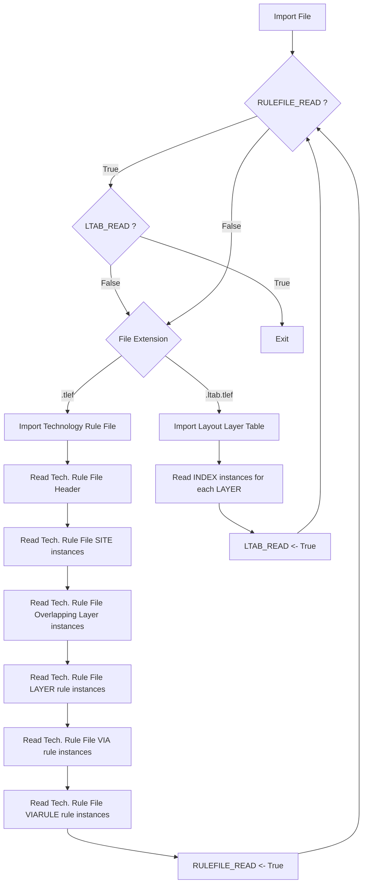

# Speedster-Technology : Import State-diagram

```mermaid
flowchart TD
    A[Import File] --> N{RULEFILE_READ ?};
    N -- True --> O{LTAB_READ ?};
    O -- False --> B{File Extension};
    N -- False --> B;
    O -- True --> Exit;
    B -- .tlef --> C[Import Technology Rule File];
    B -- .ltab.tlef --> D[Import Layout Layer Table];
    C --> E[Read Tech. Rule File Header];
    E --> F[Read Tech. Rule File SITE instances];
    F --> G[Read Tech. Rule File Overlapping Layer instances];
    G --> H[Read Tech. Rule File LAYER rule instances];
    H --> I[Read Tech. Rule File VIA rule instances];
    I --> J[Read Tech. Rule File VIARULE rule instances];
    D --> K[Read INDEX instances for each LAYER];
    K --> L[LTAB_READ <- True];
    J --> M[RULEFILE_READ <- True];
    M --> N;
    L --> N;
```